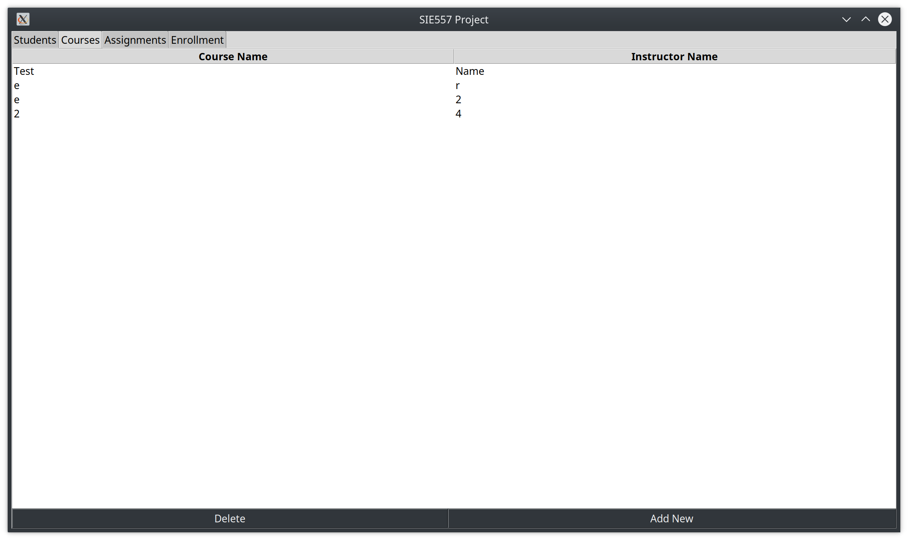

#Colin Leary's SIE557 final project for Spring 2020

There are two main types of data shown - entities and relationships. Show below is an example of an entity tab, and the form that allows a new entity to be inserted.

