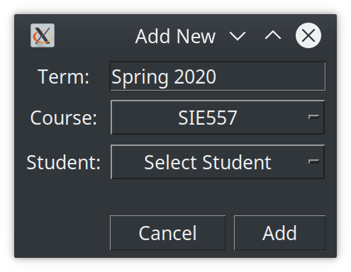
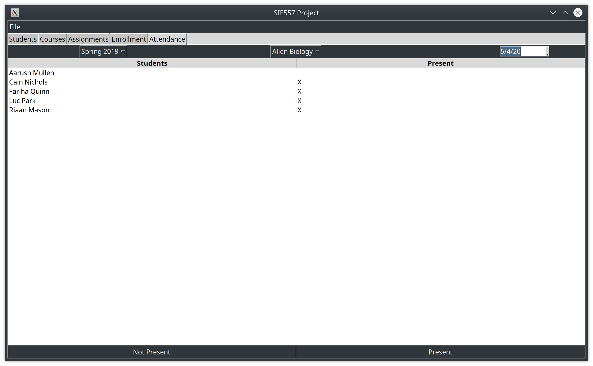

# Colin Leary's SIE557 final project for Spring 2020

There are two main types of data shown - entities and relationships.

## Entities
All entities function in a very similar manner - shown below is an example of the view, and the data entry form.


An entity table is roughly of the form:
```
CREATE TABLE entity (
    id INT UNSIGNED AUTO_INCREMENT NOT NULL PRIMARY KEY,
    name VARCHAR(30) NOT NULL,
    ...
    CONSTRAINT UNIQUE (name,...)
)
```

There are a few things of note:
1. There is an ID, which is the primary key
2. There is a constraint on one or more data elements to prevent duplicates
3. There can be an arbitrary number of columns, this does not affect the database design.

Currently, there are not very many data columns, but more could easily be added. Entities are fairly easy to add columns to, and update the application accordingly. Certain types of data (such as a date) might take more effort, but this is because the data entry portion of that might either be automated (taking today's date) or require a special entry field (date selector instead of text box).

## Relationships
Relationships are combinations of entities to create a useful application. Shown here are Enrollment and Attendance relationships.

Unlike entity tabs, these to not have a well-established form. Generally, these will have foreign keys into other tables, as they are defining how other tables relate to each other.

### Enrollment
The Enrollment relationship utilizes a view to combine student,course and enrollment data. The data entry form still requires manual data entry for the term (autofilled if one is selected already), but forces the user to select from a drop-down of available students and courses.



If the student or course does not show up in the list, it must be added to the student or course entity table, in that table's respective tab.

The enrollment table is pretty straight forward:


| id  | student_id | course_id | term        |
|-----|------------|-----------|-------------|
| 153 |          1 |         2 | Fall 2017   |
|  98 |          1 |         2 | Fall 2018   |
|  92 |          1 |         2 | Spring 2019 |
|  58 |          1 |         3 | Spring 2019 |

It still has an ID of it's own, which is the primary key, but it also contains a key into the student and course table. The enrollment also contains it's own piece of data: the term. To make this easier to use in the application, a view can be created:

| id  | term        | c_id | c_name            | s_id | s_name       |
|-----|-------------|------|-------------------|------|--------------|
|  58 | Spring 2019 |    3 | Life Gardening    |    1 | Fariha Quinn |
|  92 | Spring 2019 |    2 | Planetary Biology |    1 | Fariha Quinn |
|  98 | Fall 2018   |    2 | Planetary Biology |    1 | Fariha Quinn |
| 153 | Fall 2017   |    2 | Planetary Biology |    1 | Fariha Quinn |

This allows us to only look at one table (technically view), and use a student's name and a course's title, rather than just the ID when displaying this in the UI.

### Attendance
The attendance tab is very similar to the enrollment tab. It requires a term and course be selected, which will show a list of students enrolled in the course for that term. The difference is that rather than being able to add or remove students from that course, they can be marked present or not present for a given day. There is a date picker provided to select the date of interest.


The attendance table is structured as follows:
| enrollment_id | date       |
|---------------|------------|
|            40 | 2020-05-04 |
|            41 | 2020-05-04 |
|            42 | 2020-05-04 |
|            44 | 2020-05-04 |

All it contains is the enrollment ID, and a date. Since enrollment contains a term, course and student, by adding a date, we essentially can keep track of whether or not a student was present in a course on a given date, with minimal duplication of information.
