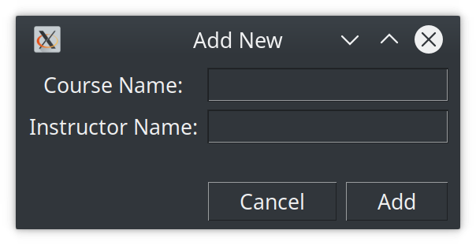

# Colin Leary's SIE557 final project for Spring 2020

There are two main types of data shown - entities and relationships.

## Entities
All entities function in a very similar manner - shown below is an example of the view, and the data entry from.

## Relationships
The first relationship created was the enrollment relationship. This utilizes a view to combine student,course and enrollment data. The data entry form still requires manual data entry for the term (autofilled if one is selected already), but forces the user to select from a drop-down of available students and courses.

